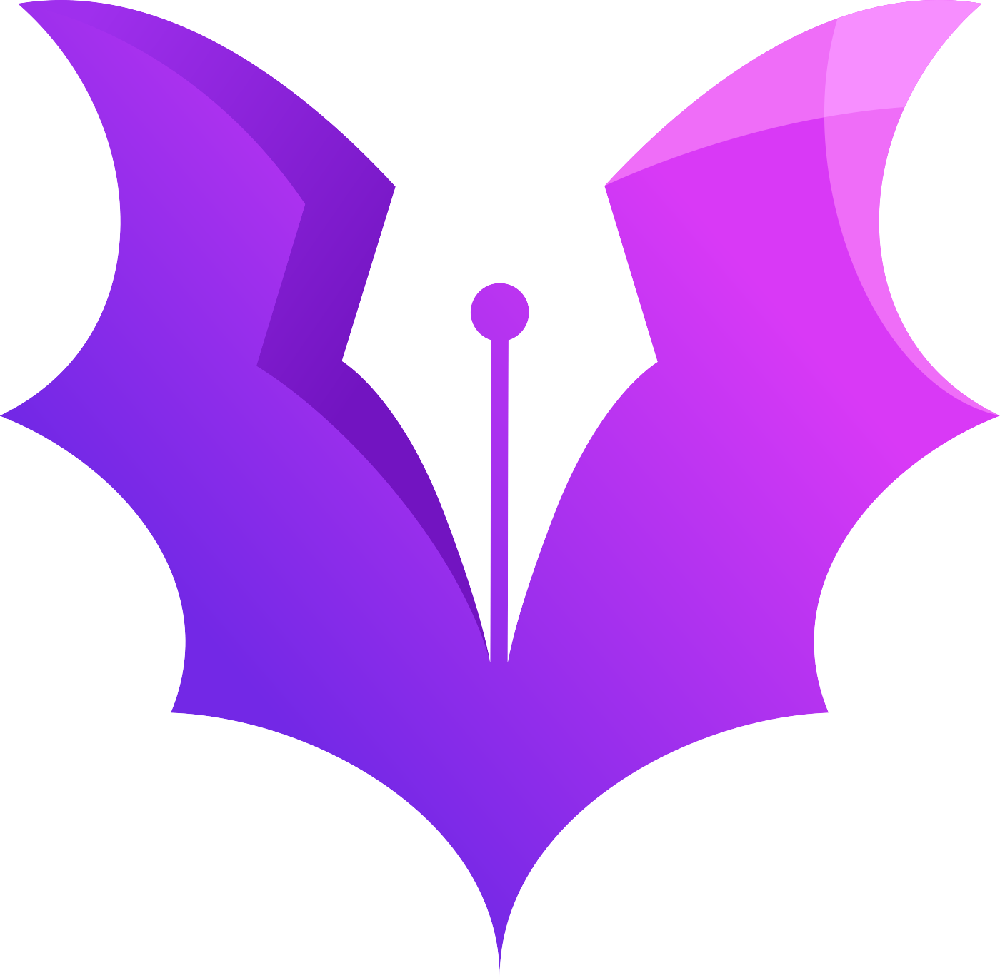

# vgpu

 

An interactive, hardware-accelerated vector graphics simulation engine written in rust.

# Motivation

The goal is to prototype an interactive simulation engine using a leading GPU path rendering library. This project is hoping to prove GPU vector graphics' usefulness in the graphic programming ecosystem through means of benchmarking and demos. This project is dependent on the research in [vgpu-bench](https://github.com/simbleau/vgpu-bench) to complete before proceeding with a logical renderer.

The intent is for this engine library to be capable of interactive physical simulations using paths with infinitessimally precise continuous collision detection.

# Sections

* [Motivation](#motivation)
* [State](#state)
* [FAQ](#faq)
* [Contributing](#contributing)
* [License](#copyright-and-license)

## State

vgpu is in stalled development. It will be developed after research has been completed in [vgpu-bench](https://github.com/simbleau/vgpu-bench).

## FAQ

### In a nutshell, what is an interactive simulation engine?

An interactive simulation engine provides an API abstraction to digest input which will be rendered in real-time to visualize a simulation.

### What is left to do before vgpu 1.0?

See the [1.0 milestone](https://github.com/simbleau/vgpu/milestone/1) on the github repository.

### I need help!

Don't hesitate to [file an issue](https://github.com/simbleau/vgpu/issues/new) or contact [@simbleau](https://github.com/simbleau) by [e-mail](mailto:spencer@imbleau.com).

## Contributing

See [CONTRIBUTING.md](https://github.com/simbleau/vgpu/blob/master/CONTRIBUTING.md).

## Copyright and License

Copyright (C) 1991, 1999 Free Software Foundation, Inc.

Licensed under the GNU LESSER GENERAL PUBLIC LICENSE, Version 2.1 (the "License").
You may obtain a copy of the License at

    https://www.gnu.org/licenses/old-licenses/lgpl-2.1.html

Unless required by applicable law or agreed to in writing, software
distributed under the License is distributed on an "AS IS" BASIS,
WITHOUT WARRANTIES OR CONDITIONS OF ANY KIND, either express or implied.
See the License for the specific language governing permissions and
limitations under the License.
